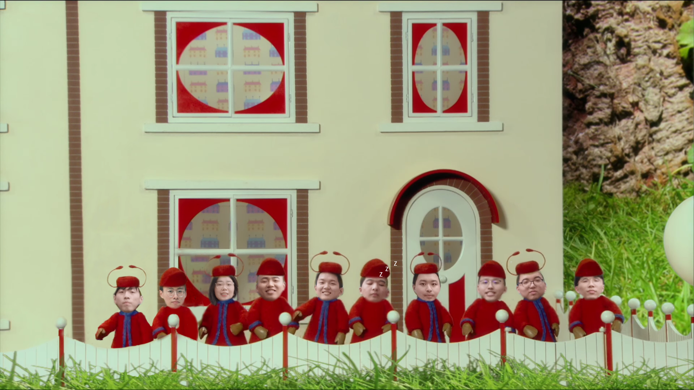
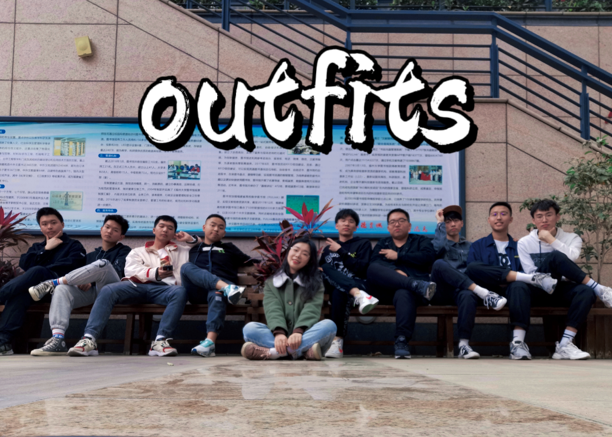
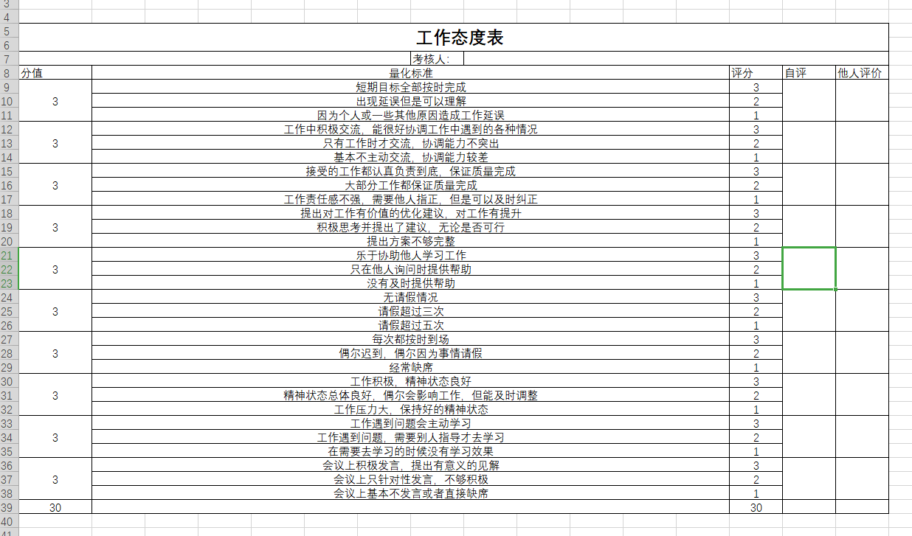
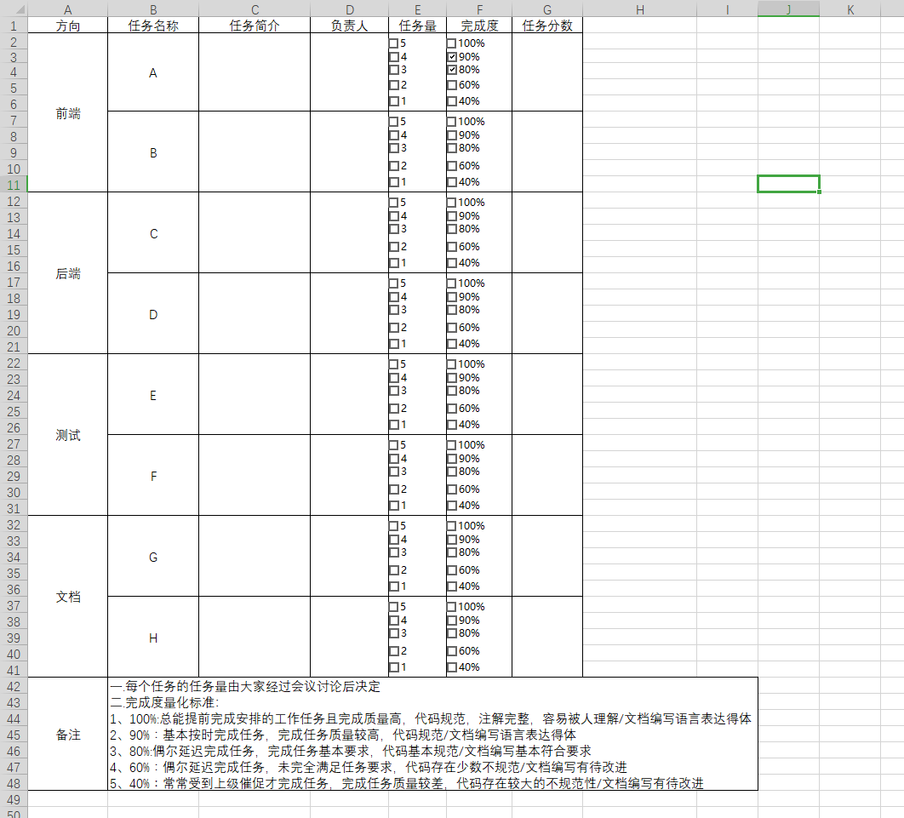

| 这个作业属于哪个课程 | [2021春软件工程实践\|W班\(福州大学\)](https://edu.cnblogs.com/campus/fzu/2021SpringSoftwareEngineeringPractice/) |
| :----    | :----   |
| 这个作业要求在哪里 | [团队作业一](https://edu.cnblogs.com/campus/fzu/2021SpringSoftwareEngineeringPractice/homework/11848)|
|团队名称|outfits|
| 这个作业的目标 |完成组队，完成团队项目的确定、需求分析以及绩效考核方案、PPT的制作|
| 其他参考文献 |《构建之法》|

#### 目录:

* [队名](#1)
* [团队项目描述](#2)
* [队员风采](#3)
* [团队合照](#4)
* [绩效考核方案](#5)
* [团队愿景](#6)
  
#### 队名
outfits
#### 团队项目描述

> OUTFITS是一个记录个人服饰、搭配及其交流分享得平台。是一款致力于将人们从每日穿搭问题中解放出来，并根据是实际情况、用户体验来提供智能化推荐服务的软件。
#### 队员风采

> * 学号：221801336
> * 成员昵称：陈小球
> * 成员博客地址：[陈小球的博客](https://www.cnblogs.com/mayrain-yh/)
> * 成员性格：笨笨的
> * 擅长的技术：产品（学习中），Python后端
> * 兴趣爱好：我爱代码
> * 希望的软工角色：PM
> * slogan：全组最废物的就是我

***

> * 学号：131802125
> * 成员姓名：邱梓洛
> * 成员博客园地址：[邱梓洛的博客](https://www.cnblogs.com/cj-whales/)
> * 成员性格：较开朗阳光
> * 擅长的技术：算法实现、前端设计
> * 兴趣爱好：看书、音乐、篮球
> * 希望的软工角色：算法实现和测试
> * slogan：冲就once了！

***

> * 学号：221801201
> * 成员姓名：凌铧钦
> * 成员博客地址：[凌铧钦的博客](https://www.cnblogs.com/VROOML/)
> * 成员性格：国家一级退堂鼓演奏家
> * 擅长的技术：安卓
> * 兴趣爱好：F1、听歌、游泳
> * 希望的软工角色：移动端开发/前端开发
> * slogan：冲冲冲！

***

> * 学号：221801307
> * 成员昵称：盫曌
> * 成员博客地址：[盫曌的博客](https://www.cnblogs.com/1069042059crj/)
> * 成员性格：动若脱兔，静若处子
> * 擅长的技术：java\go语言的后端
> * 兴趣爱好：追番打游戏睡觉
> * 希望的软工角色：安卓后端
> * slogan：足够优秀再大方拥有

***

> * 学号：221801239
> * 成员姓名：221801239_林龙星
> * 成员博客地址：[林龙星的博客](https://www.cnblogs.com/llx221801239/)
> * 成员性格：肯学习，有自制力
> * 擅长的技术：Java
> * 兴趣爱好：听音乐、看书、玩主机游戏
> * 希望的软工角色：后端
> * slogan：满招损，谦受益

***

> * 学号：221801208    
> * 成员昵称：Sakura
> * 成员博客园地址：[Sakura的博客](https://www.cnblogs.com/SakuChyan/)
> * 成员性格：调皮捣蛋，幼稚活泼
> * 擅长的技术：机器学习，.net后端
> * 兴趣爱好：唱歌睡觉（有的时候可以同时干这两件事）
> * 希望的软工角色：后端
> * slogan：学习新思想，争做新青年

***

> * 学号：221801210
> * 成员姓名：林子鹏
> * 成员博客园地址：[林子鹏的博客](https://www.cnblogs.com/221801210lzp/)
> * 成员性格： 随和，细心谨慎，乐观，敢于冒险
> * 擅长的技术：无特别擅长技术，大多数技术都有所涉及
> * 兴趣爱好：听音乐，打篮球，LOL，看动漫
> * 希望的软工角色：后端
> * slogan：NO PAIN NO GAIN

***

> * 学号：221801227
> * 成员昵称：turning
> * 成员博客地址：[turing的博客](https://www.cnblogs.com/lincanghai/)
> * 成员性格：敦厚、开朗、乐观、有时暴躁
> * 擅长的技术：web、微信小程序、vue、python
> * 兴趣爱好：跑步、游泳、看小说、听音乐
> * 希望的软工角色：前端、PM
> * slogan：因为心有所念，所以努力拼搏。

***

> * 学号：221801425
> * 成员姓名：张吴晗
> * 成员博客地址：[张吴晗的博客](https://www.cnblogs.com/zwh1515071283/)
> * 成员性格：憨、外向
> * 擅长的技术：python、java、web（都只会一些）
> * 兴趣爱好：篮球、听歌
> * 希望的软工角色：前端
> * slogan：十年饮冰，难凉热血。

***

> * 学号：221801401
> * 成员姓名：张海浪
> * 成员博客地址：[张海浪的博客](https://www.cnblogs.com/zhlforreal/)
> * 成员性格：中立，谦虚，肯干 
> * 擅长的技术：前端、java（均马马虎虎）
> * 兴趣爱好：打篮球、听音乐、旅行
> * 希望的软工角色：前端
> * slogan：be confident
#### 团队合照

#### 绩效考核方案

##### 考核方案

本方案以“激励队员积极做好的、更大的贡献”为中心设定，并具有人性化的成分。

个人绩效分数分为两部分，70%**个人工作成果**+30%**个人工作态度**。

（一）工作成果

1. 项目分配任务时，细分每个方向的任务，并确定每个任务的负责人，并讨论每个任务的任务量。任务量大致由任务的难易度和工作量这两方面决定。

2. 在任务完成后，由PM根据完成度量化标准对任务完成度进行打分，计算出任务分数（任务分数 = 任务量 * 完成度）。

3. **个人工作成果** = 70分 * 个人贡献度 * 个人平均完成度

   个人贡献度 = 80% + ( 个人任务量 – 人均任务量 ) / 人均任务量 * 50%  (<=100%)

   个人平均完成度 = 个人任务所得分数 / 个人总任务量
   
   > 通过在个人贡献度中，降低个人任务量超远平均任务量的队员的贡献度收益，来反向促进团队中在分配任务量时尽量让每一位队员的任务量趋于平均，不会出现过多或者过少，同时也避免某一队员因完成过多工作而工作完成度不高。

（二）工作态度

1. **个人工作态度**得分即工作态度考核表上得分。
2. 项目完成后，PM根据每个人的工作态度在工作态度考核表上评分。
3. 工作态度表中也有对于请假相应的考评条目。

##### 考核表

> 个人工作态度考评表

> 个人任务量统计表

#### 团队愿景
> 我们团队配置合理，拥有各方面所需的技术人员。并且我们全都了解穿搭储存、推荐这一市场需求。我们计划在项目完成三个月后达到用户量破千。目标半年内用户范围扩展至福州大学城。团队将会根据用户反馈针对性修改、调整功能。我们将填补服装产品闭环的空缺，打造一款集成了电子衣柜、穿搭记录、穿搭推荐、分享咨询等功能的软件。针对服装相关的大部分问题进行一站式解决。在未来，我们计划添加人体建模功能，能准确识别使用者的身材脸型进行匹配并生成相应模型，实现立体在线试穿，ar试穿等功能；加强导入图片的处理功能，实现人像漫画化。

